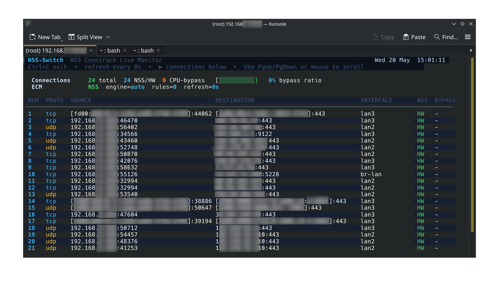
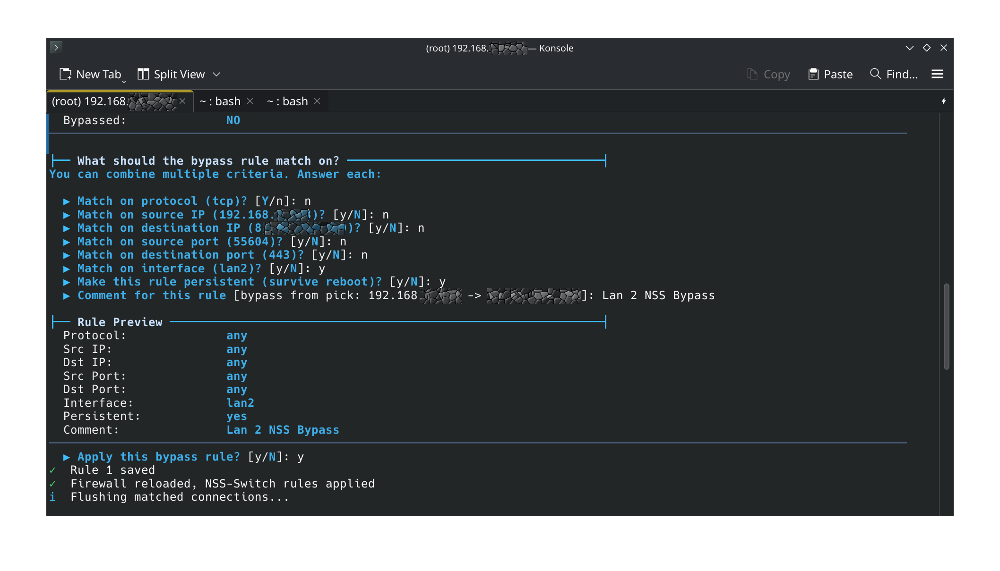
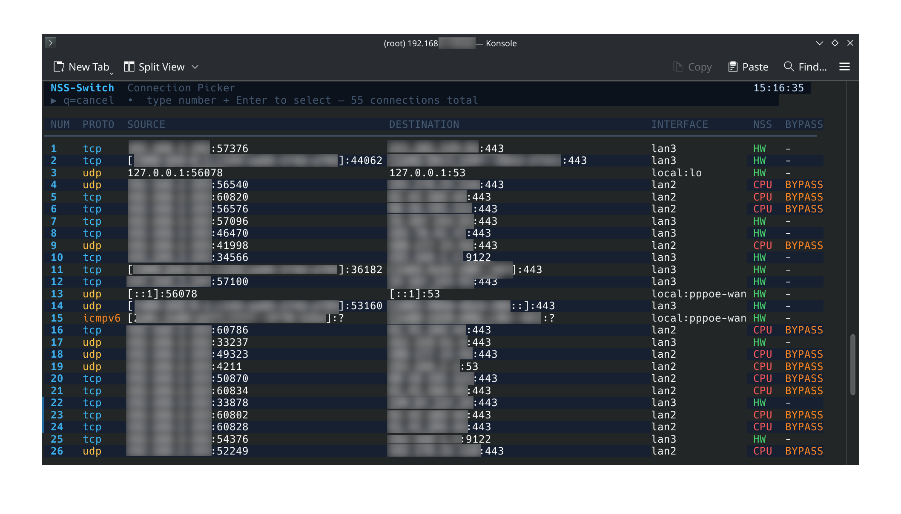

# NSS-Switch - QualcommAX NSS Bypass Tool

A selective CPU bypass manager for Qualcomm NSS (Network Subsystem) on OpenWrt.  
This tool allows you to mark specific connections so they are processed by the **CPU** instead of the **NSS hardware accelerator**.  
Also compatible with MediaTek PPE/HNAT, other SFE solutions and Software Flow Offload.



Useful (and **needed**) for:

- Traffic that needs deep inspection (e.g., `tcpdump`, `bandwidthd`, `snort`)
- Debugging or troubleshooting NSS offload issues
- Per-flow bypass rules without disabling NSS globally

**No service/network restart required to bypass (hot-swapping) any NSS connection.**

> 📌 Check [`CHANGELOG.md`](./CHANGELOG.md) for detailed history / [`PENDING.md`](./PENDING.md) for pending work.

---

## Usage

```bash
# Bypass all traffic from a specific device
nss-switch add --src-ip 192.168.1.50 --comment "PC off NSS"

# Bypass SSH traffic (temporary)
nss-switch add --proto tcp --dst-port 22 --temp

# Interactive: pick a connection and create a rule
nss-switch pick
```


```bash
# Live monitor with 5-second refresh
nss-switch watch 5
```



### 🚀 Commands

| Command | Description |
|---|---|
| `nss-switch watch [--once] [interval]` | Live TUI monitor – refreshes every interval seconds. Use PgUp/PgDown / mouse to scroll. |
| `nss-switch pick` | Browse all active connections interactively and create a bypass rule from the selected one. |
| `nss-switch add [options]` | Manually add a bypass rule. |
| `nss-switch list` | List all defined bypass rules. |
| `nss-switch remove <id>` | Remove a bypass rule by ID. |
| `nss-switch kill <id> or [--options]` | Kill active connections matching rule ID, or --flags. |
| `nss-switch flush [--rules\|--all\|--temp]` | Remove rules from nftables. |
| `nss-switch apply` | Re-apply `rules.conf` to nftables. |
| `nss-switch status` | Show full status dashboard (ECM state, rules, conntrack). |
| `nss-switch config [KEY] [VALUE]` | View or set configuration (`PERSIST_DEFAULT`, `DEBUG_MODE`, `WATCH_INTERVAL`). |
| `nss-switch debug <subcmd>` | Debugging tools – see `nss-switch debug --help`. |

---

# ➕ `add` Options

| Option | Description |
|---|---|
| `--proto tcp\|udp\|icmp\|any` | Match protocol |
| `--src-ip <IP/CIDR>` | Match source IP or subnet |
| `--dst-ip <IP/CIDR>` | Match destination IP or subnet |
| `--src-port <port>` | Match source port (TCP/UDP) |
| `--dst-port <port>` | Match destination port (TCP/UDP) |
| `--iface <interface>` | Match input interface (`out:<iface>` for egress) |
| `--persist` | Rule survives reboot |
| `--temp` | Temporary rule (lost on reboot) |
| `--comment <text>` | Human-readable label |
| `--no-defunct` | Skip ECM defunct after adding |


---

# 📦 Installation on OpenWrt

## Pre-requisites
- [X] - OpenWRT +25.12 with NSS (QCA SSDK) enabled
- [X] - Full `conntrack` / `iptables-nft` support.

## Releases
* [**`v.1.0` for `aarch64` devices**](https://github.com/alexandrglm/openwrt_NSS_Bypass_tool/releases/tag/v1.0.0-r1-aarch64)
    * Intended for `ipq807x` devices with NSS hardware offloading capabilities. Shell / C hybrid for performance optimisation.

* [**`beta-staging` version for any platform (`noarch`)**](https://github.com/alexandrglm/openwrt_NSS_Bypass_tool/releases/tag/v1.0.0-r1-DEBUG)
    * Targeted for **any** device equipped with NSS, as well as **any** device using Software Flow Offloading (SFE). Bad performance (10x slower than C compiled components version). Suitable for tests or debug. 
 

## APK file
```bash
nss-switch-1.0.0-r1-aarch64-selfsigned.apk --allow-untrusted
```

> RSA `nss-switch.rsa.pub`public key is included in the repository/releases so it can be added to `/etc/apk/keys/` directly, making the `--allow-untrusted` flag unnecessary.


## Manual Installation (noarch, beta/staging release)
- Using `install.sh` script

```bash
# Put the install.sh into your /tmp/ and run the installer
chmod +x install.sh
./install.sh
```

The installer:

- Copies all scripts to `/usr/bin/NSS-Switch/`
- Creates the needed symlinks
- Sets up persistent firewall includes for `fw4`
- Installs default configuration

---

## How it works

```
Mark 0x00010000 to desired packet -> Makes an ECM defunct -> So, CPU handles this traffic -> NSS bypass achieved
```

> NSS-Switch injects `nftables` rules into the kernel's `mangle` `pre` & `post` tables to set a specific packet mark (`0x00010000`) on matching connections. This mark is designed to not interfere with other marking schemes.

1. **Marking**: When a packet matches a user-defined rule (by IP, port, interface, etc.), nftables applies the `0x00010000` mark to the packet.

2. **Saving to conntrack**: A postrouting rule saves this mark to the connection tracking entry (`ct mark`), ensuring both directions of the flow carry the same mark.


> When ECM (Enhanced Connection Manager) detects this mark in a packet, it **defuncts** the connection (to shut it down for an established NSS path), forcing an immediate re‑evaluation. The mark persists as long as the rule persist, so ECM hands the flow to the **CPU** instead of the NSS hardware accelerator as needed.


3. **ECM defunct**: The Enhanced Connection Manager (ECM), which normally accelerates connections via NSS hardware, detects this mark and immediately **defuncts** the connection, forcing a full re‑evaluation.

> Now, the connection is processed by the CPU, bypassing NSS acceleration entirely. 

> No service restart is required, and only the marked connections are affected , and NSS continues to accelerate all other traffic normally.

4. **CPU takeover**:  Because the mark persists, ECM hands the flow to the standard Linux network stack (CPU) instead of offloading it to NSS hardware.

5. **Restore on reply**: A prerouting rule restores the mark from conntrack for reply packets, maintaining bypass status in both directions.


---

# 🧪 Status
| | |
|---|---|
| Qualcomm NSS (ipq807x, ipq60xx, ipq50xx) | ✅ Tested on ipq807x, expected to work on others |
| Other offload engines (SFE, PPE, Flowtable) | ✅ Compatible, not tested, expected to work |
| `nftables` + `conntrack` | ✅ Fully working |
| Interactive UI (watch/pick) | ✅ Working |
| Persistent rules | ✅ Survive reboots |

> 📌 See [`CHANGELOG.md`](./CHANGELOG.md) for details / [`PENDING.md`](./PENDING.md) for pending work.

---


# 🤝 Contributing & PR to OpenWrt

~~This tool is not yet ready for an official OpenWrt package.~~
~~## Reason~~
~~NSS-Switch is only useful for users running a non-official OpenWrt fork with NSS support (typically developed maintained by @AgustinLorenzo, [here](https://github.com/AgustinLorenzo/openwrt)). Mainline OpenWrt does not include NSS drivers.~~
- [2025-05-23]
Submitted for review and inclusion into official OpenWrt repositories, as it is compatible with any platform with SFE (Software Flow Offloading) in use and/or QualcommAX platforms with NSS.

## If you want to help

- Test on other SoC's which includes any NSS solution (`ipq60xx`, `ipq50xx`)
- Report bugs with `nss-switch debug env` output
- Submit fixes or improvements

---

# License

GPL-2.0-or-newer

---

# 👏 Thanks

- @AgustinLorenzo / @qosmio: OpenWrt NSS forks, `nss_packages`, `qca-ssdk`, and inspiration
- Any community testers on `ipq807x` hardware
